# Veiledning 06

## Hente ut data fra OpenStreetMap og vise i kart

I denne veiledningen skal vi hente ut noe data fra OpenStreetMap og vise fram på et kart med enkel kartografi. Vi skal se på to ulike metoder for å hente ut data fra OpenStreetMap og vi skal bruke Cartodb tjenesten for å vise fram dataene. 

Det finnes også en veiledning 07 der vi bruker det vi har lært i denne veiledningen og gjør noen analyser på dataene i Cartodb. 

### Eksporter data fra OpenStreetMap

OpenStreetMap er et dugnadsbasert kart der alle kan bidra. Vi skal eksportere skiløyper og adressedata med to ulike metoder. 

#### Overpass API
Først skal vi eksportere de populære skiløypene på Sjusjøen ved Lillehammer. Vi skal bruke en tjeneste som heter Overpass Turbo for å eksportere disse dataene. Start med å åpne [http://overpass-turbo.eu/s/9Hj](http://overpass-turbo.eu/s/9Hj). Du ser nå at kartet allerede er plassert over Sjusjøen. Avhengig av skjermstørrelsen din må du kanskje justere kartet noe. 

Venstre del består at et tekstfelt med noe kode. Og høyre av kartet. Start med å trykke på "Run"-knappen oppe i venstre hjørne. Du ser nå at alle skiløyper vises i kartet til høyre. Vi skal ikke gå igjennom hvordan du koder koden til venstre i denne veiledningen, men en way i OpenStreetMap betyr en linjeobjekt og skiløyper tagges med piste:type=nordic. 

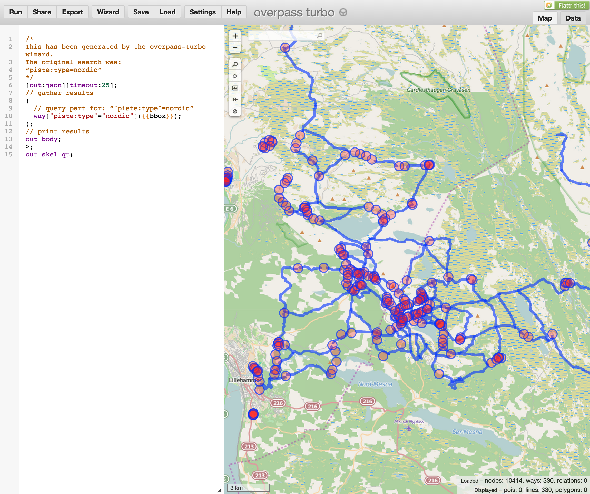

Den letteste måten å finne andre objekter på er å trykke på "Wizard"-knappen øverst og legge inn de taggene en ønsker. Det er gitt noen eksempler i dialogboksen som kommer opp. Prøv deg gjerne fram, men husk å gå tilbake til [koden for å hente ut skiløyper](http://overpass-turbo.eu/s/9Hj) før du går videre. 

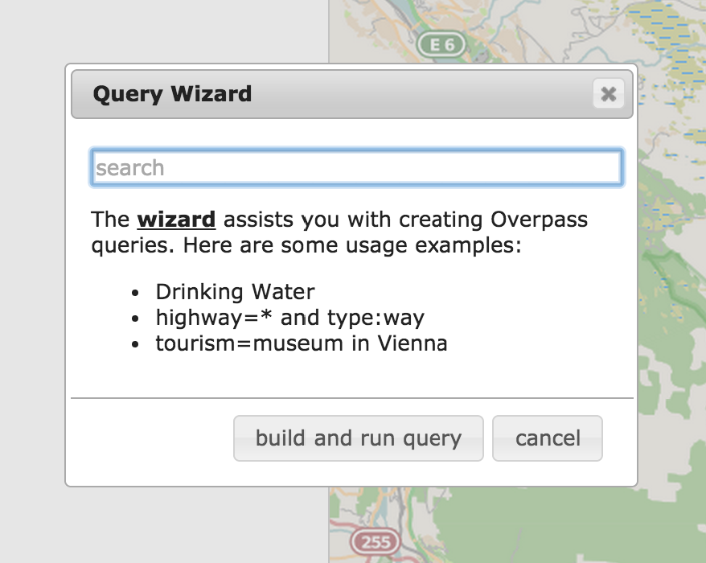

Etter at du trykker på "Run"-knappen og får skiløypene i kartet så kan du enkelt eksportere disse dataene ved å trykke på "Export". Deretter trykker du på geoJSON linken og venter til dataene er lastet ned. Pass på å endre navnet på filen til skiloyper.geojson når filen er lastet ned. 

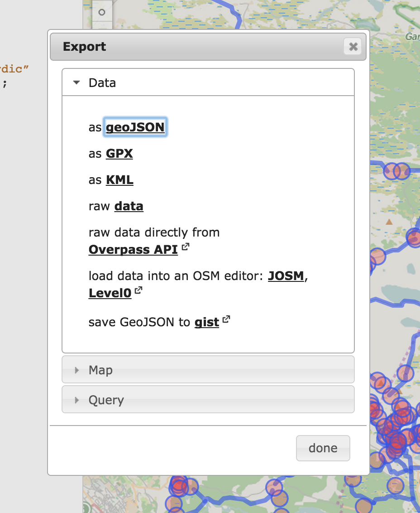

#### Osmosis og osmconvert

Så skal vi eksportere adressedata for Sjusjøen. Overpass er fin å bruke for å eksportere mindre data og selv om vi fint kunne ha brukt det for å hente ut adressedata også, så er det fint å kunne en metode når du vil ha data for et litt større område en Sjusjøen. Som f.eks. hele Norge eller hele verden. 

Vi skal først laste ned dagsoppdaterte OpenStreetMap data for hele Norge. Gå til [http://download.geofabrik.de/europe/norway.html](http://download.geofabrik.de/europe/norway.html) og last ned filen norway-latest.osm.pbf

Deretter skal vi bruke to verktøy. Osmosis for å hente ut akkurat de dataene vi trenger og osmconvert for å filtrere ut data kun over Sjusjøen. Start med å innstallere Osmosis og osmconvert. Du finner oppskrifter for hvordan du gjør dette for Windows og Mac her:
- [Osmosis på Windows](http://wiki.openstreetmap.org/wiki/Osmosis/Quick_Install_%28Windows%29)
- [Osmosis på Mac](http://wiki.openstreetmap.org/wiki/Osmosis/Installation#OS_X)
- [Osmconvert på Windows](http://wiki.openstreetmap.org/wiki/Osmconvert#Download)
- Osmconvert på Mac. Kjør denne kommandoen i et terminalvindu `wget -O - http://m.m.i24.cc/osmconvert.c | cc -x c - -lz -O3 -o osmconvert`

OK, da er har vi forhåpentligvis alt på plass. Nå skal vi bruke Osmosis til å hente ut adressedata fra filen vi lastet ned tidligere. Filen er i [PBF-formatet](http://wiki.openstreetmap.org/wiki/PBF_Format) som er en komprimert alternativ til det vanlige XML-formatet som OSM bruker. Vi sier derfor til osmosis av vi leser inn en PBF file og skriver til en vanlig xml fil. Vi sier også at vi kun skal ha ways(dvs linjer) med taggingen addr:housenumber. Det betyr alle punkter(eller noder i OSM) som har et husnummer. 

Kjør nå følgende kommando:

`osmosis --read-pbf norway-latest.osm.pbf --tf accept-nodes addr:housenumber=*  --write-xml adresser.osm`

Vi har da en stor file med alle adresser i hele Norge som heter adresser.osm. Vi skal nå hente ut kun de adressene som gjelder for Sjusjøen. Det er mange måter å gjøre det på, men i dette tilfellet så har vi laget en poly fil som inneholder et polygon som dekker Sjusjøen. Du kan lese mer om [poly-formatet her.](http://wiki.openstreetmap.org/wiki/Osmosis/Polygon_Filter_File_Format)

Vi kan da hente ut adressene for Sjusjøen med osmconvert:

`osmconvert adresser.osm -B=poly/sjusjoen.poly > adresser_sjusjoen.osm`


### Importer data i Cartodb

Vi skal nå importere dataene våre og lage et enkelt skikart. Først må du opprette en gratis konto hos Cartodb hvis du ikke allerede har det:

https://cartodb.com/signup

Gå deretter til "Your datasets" i toppmenyen. 

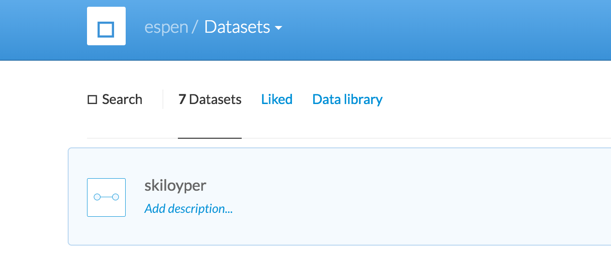

Trykk så på "New Dataset" og velg deretter "Select a file". Velg nå først adresser_sjusjoen.osm og trykk på "Connect Dataset".

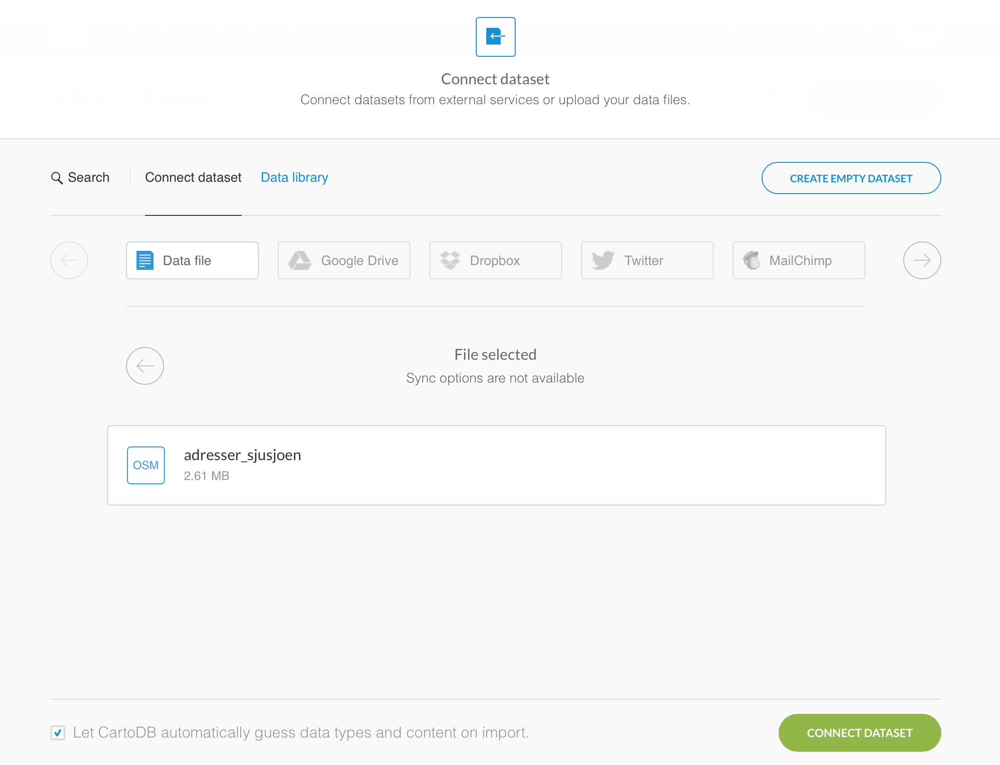

Gjenta hele prosessen og velg skiloyper_sjusjoen.geojson. Merk at vi har to filer med forskjellig format, men Cartodb forstår forskjellen og leser de automatisk inn. Kommer du inn i tabellen til adresser_sjusjoen så trykk bare på pila øverst i venstre for å komme tilbake til hovedsida. 

Når begge datasettene er importert så klikker du på begge slik at de blir markert og velger "Create map" ovenfor. 

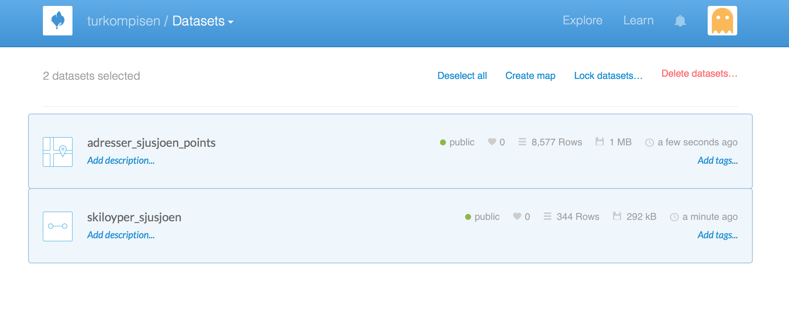

Du få nå opp et kart hvor Cartodb allerede har laget en enkel kartografi for deg. 

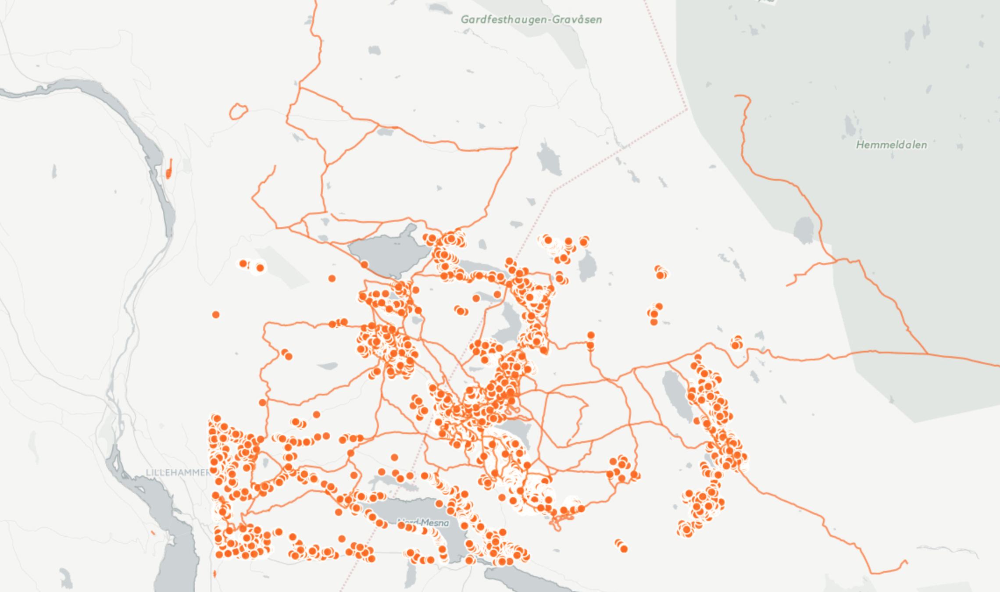

På høyre side av kartet har noen faner der du kan velge mellom skiløypene eller addressepunktene. Klikk på den av de som sier skiloyper_sjusjoen når du holder musepekeren over den. 

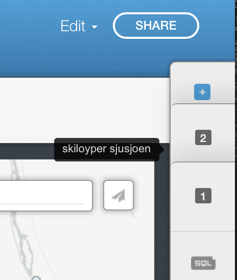

Du kan nå trykke på Wizard-knappen og så skal vi endre litt på kartografien. Vi legger til en label på de skiløypene som har et navn, som f. eks. Birkebeinerløypa. Her kan du leike deg litt fram og prøve forskjellige ting. I mitt eksempel så har jeg satt alle verdier slik:

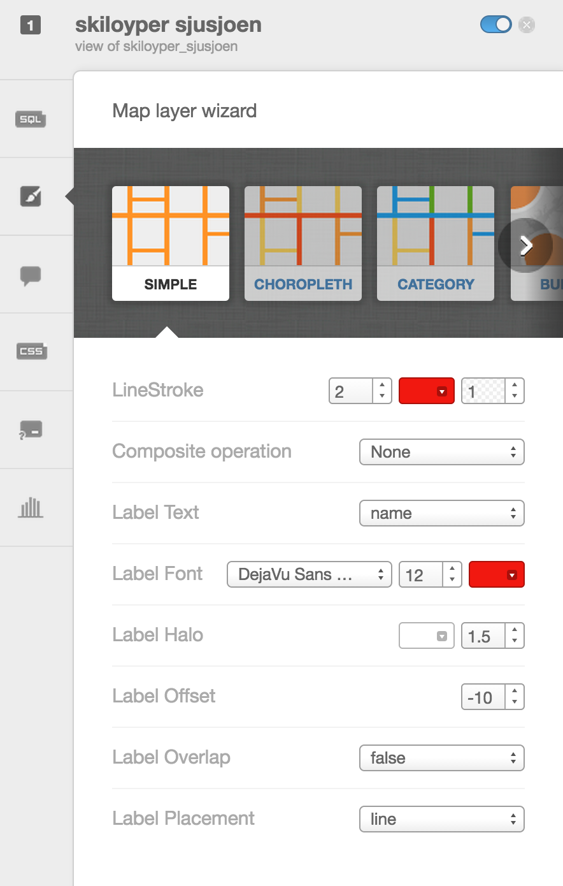

Vi skal også endre litt på kartografien for å vise fram skiløyper som er skuterkjørt og skiløyper med lys. For å gjøre dette trykker vi på CSS-knappen og legger til følgende kode:

```
#skiloyper_sjusjoen[piste_grooming='scooter']{
  line-color: #F11810;
  line-width: 2; 
  line-dasharray: 2,3;
  line-opacity: 1;
}

#skiloyper_sjusjoen[lit='yes']{
  line-color: #5CA2D1;
  line-width: 4; 
  line-opacity: 1;
}
```

Koden sier at hvis en skiløype er skuterkjørt så skal vi ha en stipla linje og hvis skiløypa har lys(lit=yes) så skal vi tegne den med en litt annen farge. Du bør da kunne se minst en skuterkjørt skiløype og lysløypa ved Sjusjøen stadion. 

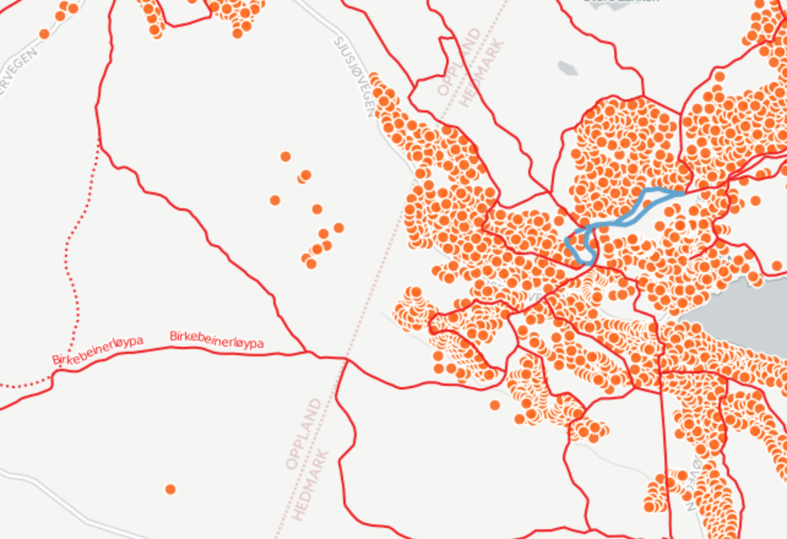

Til slutt skal vi dempe adresse punktene litt. Trykk da på fanen som sier adresser_sjusjoen_points, deretter på Wizard-knappen og justere verdiene som dette:

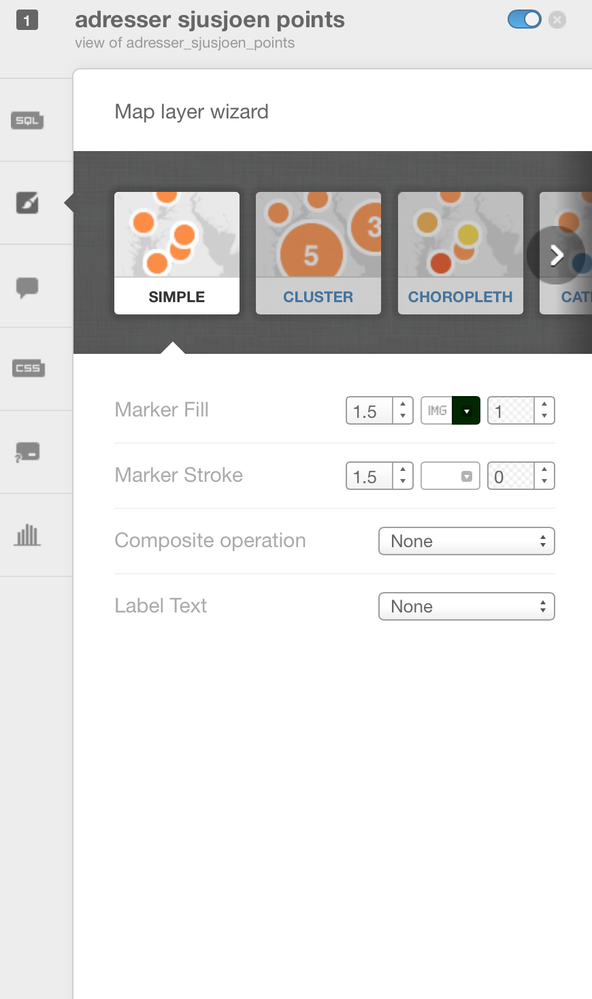

Og med den endringen så har vi et fiks ferdig skiløypekart over Sjusjøen. 

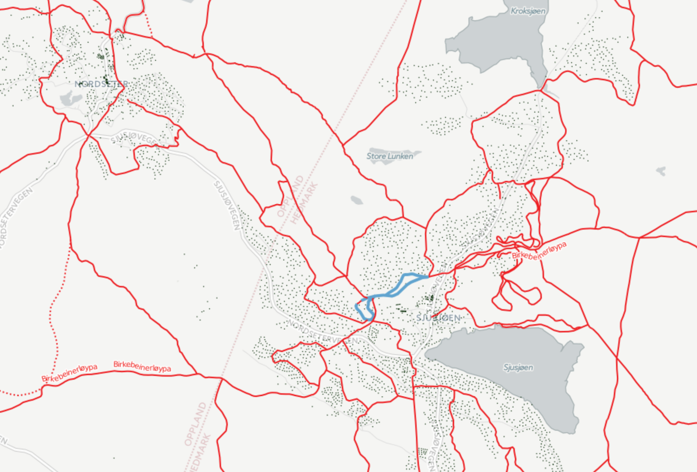

### Vise data i kart

Helt til slutt skal vi vise hvordan du kan bruke dette kartet på ditt eget nettsted. Trykk Share-knappen øverst i høyre hjørne. Du kan da enten hente kartet med en egen URL:

https://geoforum.cartodb.com/viz/9103c37e-0d44-11e5-b446-0e018d66dc29/public_map

Eller du kan embedde kartet i egen HTML:
https://htmlpreview.github.io/?https://github.com/GeoForum/veiledning06/blob/master/index.html


